---
# Front matter
# Metainformació del document
title: Instal·lació de Ghostscript. Poder imprimir certificacions
subtitle: Curso 2025-2026
titlepage: true
author: Alfredo Rafael Vicente Boix
lang: es
page-background: bg.png
colorlinks: true
linkcolor: "blue"
urlcolor: "blue"

# portada
titlepage-rule-height: 2
titlepage-rule-color: "000000"
titlepage-text-color: "000000"
titlepage-background: portada.png

# configuració de l'índex
toc-own-page: true
toc-title: Continguts
toc-depth: 2

# capçalera i peu
header-left: \thetitle
header-right: 
footer-left: DGFP
footer-right: \thepage/\pageref{LastPage}

# Les figures que apareguen on les definim i centrades
float-placement-figure: H
caption-justification: centering 

# No volem numerar les linies de codi
listings-disable-line-numbers: true

table-use-row-colors: true

# Configuracions dels paquets de latex
header-includes:

  #  imatges i subfigures
  - \usepackage{graphicx}
  - \usepackage{subfigure}
  - \usepackage{lastpage}
  - \usepackage{booktabs}
  # Per a fer tables en LATEX
  - \usepackage[table]{xcolor}
  - \setlength{\arrayrulewidth}{0.1mm}
  - \setlength{\tabcolsep}{12pt}
  - \renewcommand{\arraystretch}{2}
  - \newcolumntype{s}{>{\columncolor[HTML]{AAACED}} p{3cm}} # Definim tipus de columna
  - \arrayrulecolor[HTML]{d4d5c3} # Color de les línies


  #  - \usepackage{adjustbox}
  # marca d'aigua
  #- \usepackage{draftwatermark}
 # - \SetWatermarkText{\includegraphics{./img/Markdown.png}}
  #- \SetWatermarkText{Per revisar}
  #- \SetWatermarkScale{.5}
  #- \SetWatermarkAngle{20}
   
  # caixes d'avisos 
  - \usepackage{awesomebox}

  # text en columnes
  - \usepackage{multicol}
  - \setlength{\columnseprule}{1pt}
  - \setlength{\columnsep}{1em}

  # pàgines apaïsades
  - \usepackage{pdflscape}
  
  # per a permetre pandoc dins de blocs Latex
  - \newcommand{\hideFromPandoc}[1]{#1}
  - \hideFromPandoc {
      \let\Begin\begin
      \let\End\end
    }
 
# definició de les caixes d'avis
pandoc-latex-environment:
  noteblock: [note]
  tipblock: [tip]
  warningblock: [warning]
  cautionblock: [caution]
  importantblock: [important]
...


# Introducció

Ghostscript és un intèrpret per a llenguatges de descripció de pàgines com PostScript i PDF. És àmpliament utilitzat per a la visualització, impressió i conversió de documents en aquests formats. A més, Ghostscript és una eina essencial en molts fluxos de treball d'impressió i publicació digital.

A Gesform utilitzem Ghostscript per a generar certificacions que després es poden imprimir o enviar electrònicament. La instal·lació de Ghostscript és un pas necessari per a assegurar que el sistema pugui processar correctament aquests documents.

# Gesform i Ghostscript

Gesform és un ferramenta molt antiga per tant és necessari disposar d'una versió de Ghostscript compatible. Actualment, Gesform funciona correctament amb versions de Ghostscript 9.x (9.18 i 9.22). És important assegurar-se que la versió instal·lada sigui compatible per evitar problemes en la generació de certificacions.

# Instal·lació de Ghostscript

El primer que hem de fer és anar a la següent pàgina i descarregar la versió adequada per al nostre sistema operatiu:

[Descarregar Ghostscript](https://github.com/ArtifexSoftware/ghostpdl-downloads/releases/download/gs922/gs922w32.exe)

:::warning
Sino descarrega directament aneu a [la següent pàgina](https://github.com/ArtifexSoftware/ghostpdl-downloads/releases?page=6) i busqueu la versió 9.22 per al vostre sistema operatiu.
:::

Un cop descarregat l'instal·lador, seguirem els passos d'instal·lació habituals per al nostre sistema operatiu.
Després d'instal·lar Ghostscript, és recomanable reiniciar l'ordinador per assegurar que tots els canvis s'apliquen correctament.

# Configuració de variables d'entorn

:::warning
Si disposes d'un ordinador en Windows gestionat per la Conselleria tindràs que cridar al SAI i deixar-li este manual per a que ells facen la instal·lació, ja que no teniu accés necessari per a fer-ho.
:::

Una vegada instal·lat Ghostscript, hem de configurar les variables d'entorn perquè Gesform puga trobar l'executable de Ghostscript.

Anem a Variables d'entorn en Windows. Podem fer-ho seguint aquests passos:

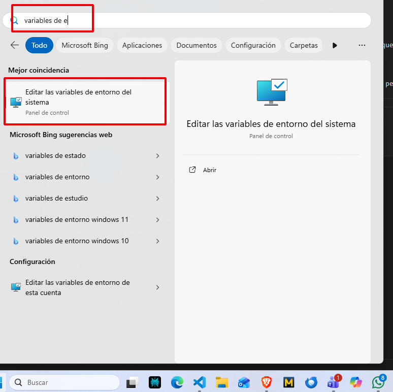{width=300px}

Apareixerà la següent finestra:

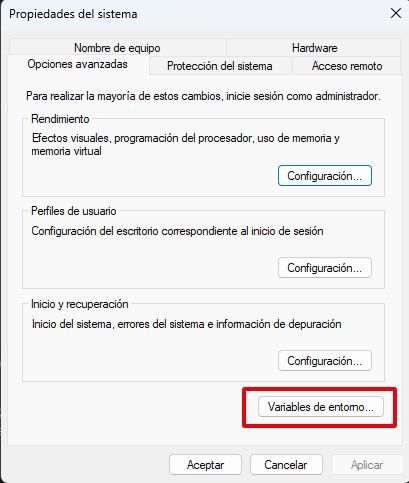{width=300px}

Fem clic a "Variables d'entorn..." i després, en la secció "Variables del sistema", busquem la variable "Path" i fem clic a "Editar...".

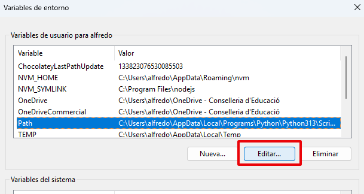{width=300px}

Fem clic en "Nuevo" i afegim la ruta on s'ha instal·lat Ghostscript. Per defecte,  `C:\Program Files (x86)\gs\gs9.22\bin`, encara no cal, jo també afegiria la ruta `C:\Program Files\gs\gs9.22\lib` per si de cas.

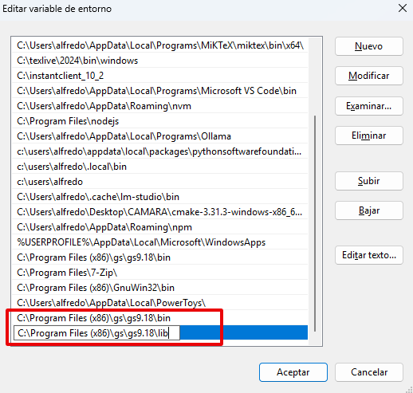{width=300px}

# Instal·lar impressora

Anem a "Dispositius i impressores" i fem clic a "Afegir una impressora":

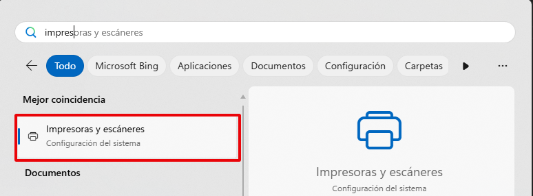{width=300px}

Una vegada dins fem clic a "Agregar dispositivo":

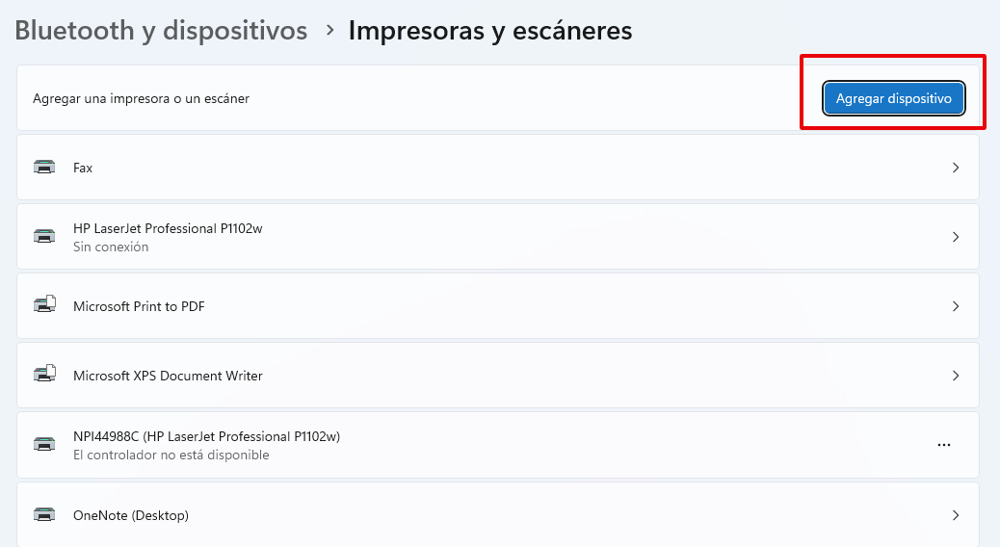{width=300px}

Esperem un poc fins que detecte la impressora i després fem clic a "Agregar un nuevo dispositivo manualmente":

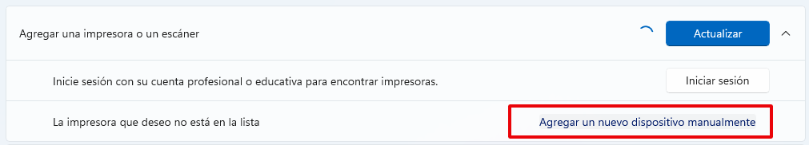{width=300px}

Hem d'afegir una impressora local de manera manual:

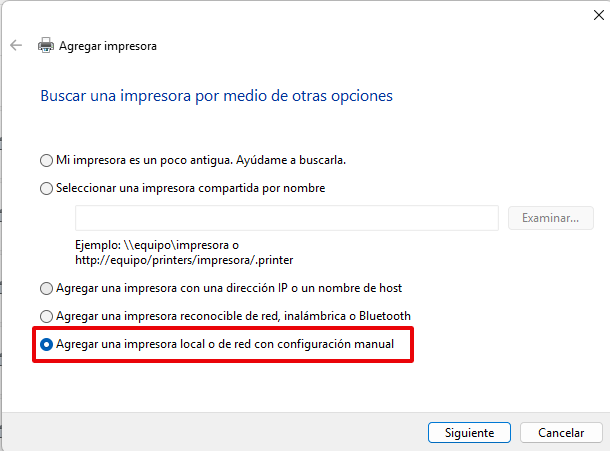{width=300px}

I fem clic en següent. En la següent finestra seleccionem "Usar un puerto existente" i triem "FILE: (Imprimir a fitxer)":

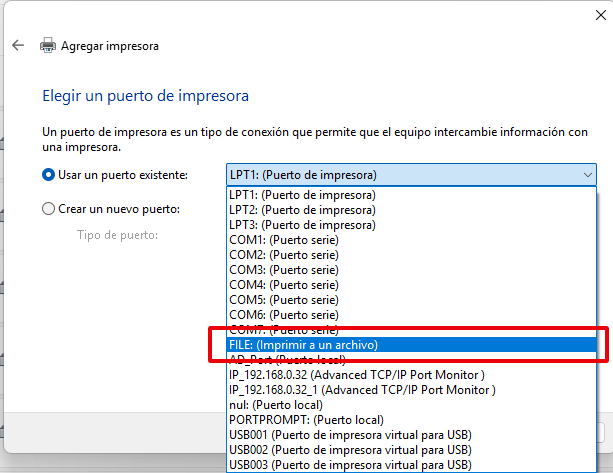{width=300px}

:::caution
És extremadament important que seleccioneu este port, ja que si no ho feu, l'impressora no funcionarà correctament.
:::

En este punt anirem a "Usar disco" i buscarem la impressora a instal·lar:

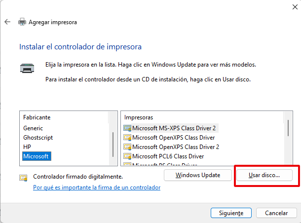{width=300px}

Buscarem l'impressaro a la següent ruta:

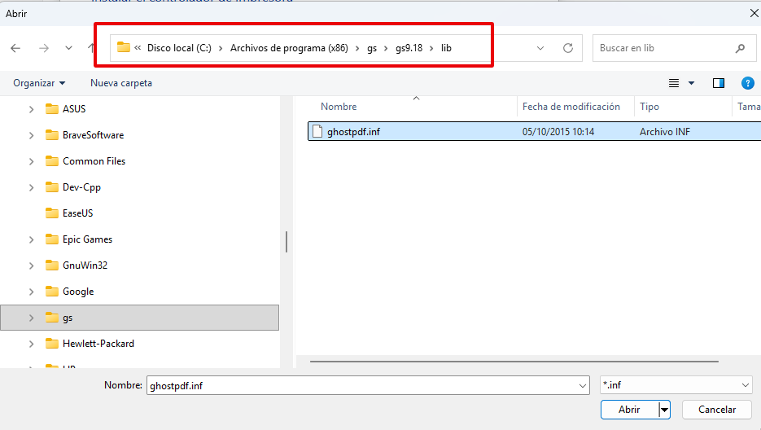{width=300px}

I seleccionarem la impressora "Ghostscript PDF":

{width=300px}

:::warning
HIPER IMPORTANT: El nom de la impresora és "Sybase DataWindow PS", tal cual està escrit, si no és així Gesform no podrà utilitzar-la. Sense S en DataWindow ni en Sybase. Eixeés el problema més comú que fa que no funcione.
:::

# Prova de funcionament

Per a provar que tot funciona correctament, obrim Gesform i anem a la secció de certificacions. Intentem generar una certificació i imprimir-la (només un certificat per si hi ha que anular-lo). Si tot està configurat correctament, la certificació s'hauria de generar sense problemes.

# LliureX

:::tip
Si teniu un ordinador amb Windows és millor que feu les certificacions amb Windows, de tota manera és possible fer-ho amb LliureX també, però cal tenir en compte certs detalls. Cal tenir instal·lat Wine.
:::

## Instal·lació Impresora Virtual

### Descarregar Ghostscript (32 bits)
Descarrega el fitxer d’instal·lació de Ghostscript, versió de 32 bits, a la carpeta de Descàrregues. Pots fer-ho des del terminal amb aquesta ordre:

```bash
wget https://github.com/ArtifexSoftware/ghostpdl-downloads/releases/download/gs10011/gs10011w32.exe -P ~/.wine/drive_c
```

### Donar permisos d’execució i moure a l’arxiu C: de Wine
Canvia els permisos del fitxer descarregat per fer-lo executable:

```bash
chmod 775 ~/.wine/drive_c/gs10011w32.exe
```

### 3. Executar Winetricks i gestionar els paquets de Wine
Obri Winetricks, amb el prefix preparat per a 32 bits. Això et permet instalar o desinstal·lar programari Windows sota Wine:

```bash
WINEARCH=win32 WINEPREFIX=~/.wine winetricks
```
A la finestra de Winetricks, prem el botó "Instal·lar".

### Instal·lar Ghostscript dins Wine

Utilitza l'opció per buscar i obrir el fitxer d’instal·lació. Has de seleccionar el tipus d’arxiu “Programas (*.exe)” i escollir `gs10011w32.exe`.

Segueix els passos predeterminats del programa d’instal·lació, però en la pantalla “Destination folder” escriu:

```
C:\CCE\gs10.011
```

### Afegir Ghostscript a la variable PATH

Excuta l’editor del registre de Windows dins Wine:

```bash
regedit
```

- Ves a la clau:

```bash
HKEY_LOCAL_MACHINE\SYSTEM\CurrentControlSet\Control\Session Manager\Environment
```

- Edita la variable PATH i afegeix al final (després d’un punt i coma) la ruta:

```
;C:\CCE\gs10.011\bin
```

```bash
HKEY_LOCAL_MACHINE\SYSTEM\CurrentControlSet\Control\Session Manager\Environment
```

- Edita la variable PATH i afegeix al final (després d’un punt i coma) la ruta:

```bash
;C:\CCE\gs10.011\bin
```

Per exemple, pot ser que ja s'hi trobe:

```
C:\windows\system32;C:\windows;C:\windows\system32\wbem
```

Afegeix la ruta de Ghostscript tal com s’indica, sense cometes. Tanca totes les claus (botó -) i ix del registre.

## Passos NO FUNCIONALS (Cal evitar)

- NO cal copiar fitxers de `C:\CCE\gs10.011\bin\*.*` a `C:\CCE\gs10.011\lib`
- NO cal copiar fitxers de `C:\CCE\gs10.011\lib\ghostpdf.*` a `C:\CCE\gs10.011\bin`
- NO cal crear una impressora local de tipus FILE anomenada "Sybase DataWindow PS" amb el driver `ghostpdf.ppd` com s’indica

## Instal·lar la Impressora PDF en Linux amb CUPS-PDF

#### Instal·lar el controlador CUPS-PDF

Obri un terminal i executa:

```bash
sudo apt-get install printer-driver-cups-pdf
```

### Afegir la impressora a través de la Configuració del sistema

- Ves a **Configuració del sistema -> Impressores**
- Prem **Afegir** i espera que aparega l’opció **Generic CUPS-PDF** a la llista de dispositius

### Configurar la impressora virtual CUPS-PDF

- Selecciona **Generic CUPS-PDF** i prem **Següent**
- Introdueix el **Nom curt:** Sybase_DataWindow_PS  
  (recorda: Si el nom conté espais, la impressora pot no funcionar correctament)
- Introdueix la **Descripció:** Sybase DataWindow PS
- Aplica la configuració

:::warning
Tot i així, de vegades no sol funcionar i depurar esta part és complexa.
:::