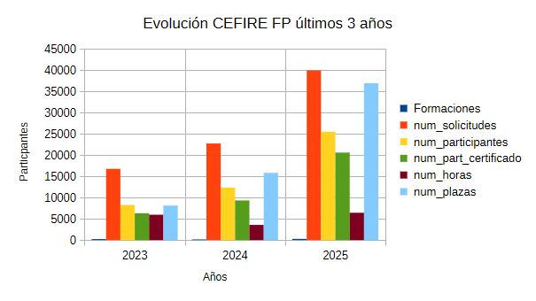

---
# Front matter
# Metainformació del document
title: Informe formaciones CEFIRE FP
subtitle: Año 2025
titlepage: true
# author: 
lang: es
page-background: bg2.png

# portada
titlepage-rule-height: 2
titlepage-rule-color: "000000"
titlepage-text-color: "000000"
titlepage-background: portada2.png

# configuració de l'índex
toc-own-page: true
toc-title: Contenidos
toc-depth: 2

# capçalera i peu
header-left: \thetitle
header-right: 
footer-left: DGFP
footer-right: \thepage/\pageref{LastPage}

# Les figures que apareguen on les definim i centrades
float-placement-figure: H
caption-justification: centering 

# No volem numerar les linies de codi
listings-disable-line-numbers: true

table-use-row-colors: true

# Configuracions dels paquets de latex
header-includes:

  #  imatges i subfigures
  - \usepackage{graphicx}
  - \usepackage{subfigure}
  - \usepackage{lastpage}
  - \usepackage{booktabs}
  # Per a fer tables en LATEX
  - \usepackage[table]{xcolor}
  - \setlength{\arrayrulewidth}{0.1mm}
  - \setlength{\tabcolsep}{12pt}
  - \renewcommand{\arraystretch}{2}
  - \newcolumntype{s}{>{\columncolor[HTML]{AAACED}} p{3cm}} # Definim tipus de columna
  - \arrayrulecolor[HTML]{d4d5c3} # Color de les línies

  #  - \usepackage{adjustbox}
  # marca d'aigua
  #- \usepackage{draftwatermark}
 # - \SetWatermarkText{\includegraphics{./img/Markdown.png}}
  #- \SetWatermarkText{Per revisar}
  #- \SetWatermarkScale{.5}
  #- \SetWatermarkAngle{20}
   
  # caixes d'avisos 
  - \usepackage{awesomebox}

  # text en columnes
  - \usepackage{multicol}
  - \setlength{\columnseprule}{1pt}
  - \setlength{\columnsep}{1em}

  # pàgines apaïsades
  - \usepackage{pdflscape}
  
  # per a permetre pandoc dins de blocs Latex
  - \newcommand{\hideFromPandoc}[1]{#1}
  - \hideFromPandoc {
      \let\Begin\begin
      \let\End\end
    }
 
# definició de les caixes d'avis
pandoc-latex-environment:
  noteblock: [note]
  tipblock: [tip]
  warningblock: [warning]
  cautionblock: [caution]
  importantblock: [important]
...

# Introudcción

El siguiente informe muestra la realización de formaciones durante el año natural 2025. Que comprendería la realización de formaciones durante el segundo y tercer trimestre del cursos 24-25 y el primer trimestre del curso 25-26.

En este informe se detallan todas las formaciones y un pequeño resumen de su realiazación, junto a su financiación y una valoración personal por parte del equipo técnico del CEFIRE de FP.

# Formaciones realizadas

## Formaciones por familias

A continuación se presenta una tabla de formaciones realizadas por familia profesional:|

| | |
| - | - |
| Fam. Actividades físicas y deportivas | 8 |
| Fam. Agraria | 9 |
| Fam. Artes gráficas | 2 |
| Fam. Edificación y obra civil | 2 |
| Fam. Electricidad y electrónica | 16 |
| Fam. Energia y agua | 7 |
| Fam. Fabricación mecánica | 5 |
| Fam. Hostelería y turismo | 7 |
| Fam. Imagen personal | 29 |
| Fam. Imagen y sonido | 7 |
| Fam. Industrias alimentarias | 3 |
| Fam. Informática y comunicaciones | 35 |
| Fam. Instalación y mantenimiento | 25 |
| Fam. Madera, mueble y corcho | 3 |
| Fam. Química | 7 |
| Fam. Sanidad | 17 |
| Fam. Seguridad y medio ambiente | 1 |
| Fam. Servicios Socioculturales y a la Comunidad | 9 |
| Fam. Textil, Confección y Piel | 1 |
| Fam. Transporte y Mantenimiento de Vehículos | 6 |
| Fam. Vidrio y Cerámica | 2 |
| Formación Profesional | 28 |
| Fam. Imagen | 8 |
| Fam. Agraria i Maritimo-pesquera | 6 |
| Fam. Processos de gestió adminsitrativa | 16 |
| Fam. Hostaleria i Turisme | 1 |
| Fam. Anàlisi i Quiímica Industrial | 10 |
| Formación y Orientación laboral | 3 |
| FP - Calidad Educativa | 1 |
| Orientación Educativa | 1 |
| TOTAL | 275 |

## Formaciones totales realizadas

A continuación se presenta una tabla con todas las formaciones realizadas con solicitudes, participantes totales y certificaciones del **año 2025**:

| Formaciones | solicitudes | participantes | certificado | horas | plazas |
| --- | --- | --- | --- | --- | --- |
| 275 | 39925 | 25488 | 20574 | 6414 | 36889 |

Con 11 asesores. Durante el **2º y 3r trimestre del curso 2024-2025**. Sólo se dedicaban a hacer formación 11 asesores, los otros 5 se dedicaban solo a PAF, tarea igualmente asumida en el curso 25-26. 

Durante el **1r trimestre de 2025** se realizaron se realizaron als siguientes formaciones:

| Formaciones | solicitudes | participantes | certificado | horas | plazas |
| --- | --- | --- | --- | --- | --- |
| 132 | 9488 | 5394 | 3794 | 3138 | 5212 |

## Años anteriores

En comparativa con los mismos perioddos de cursos anteriores:

**En 2024**:

| Formaciones | solicitudes | participantes | certificado | horas | plazas |
| --- | --- | --- | --- | --- | --- |
| 153 | 22721 | 12327 | 9315 | 3564 | 15801 |

Con 16 asesores

**En 2023**:

| Formaciones | solicitudes | participantes | certificado | horas | plazas |
| --- | --- | --- | --- | --- | --- |
| 225 | 16748 | 8267 | 6296 | 5957 | 8102 |

Con 16 asesores

En el siguiente gráfico podemos obsevar la evolución de las formaciones realizadas:

En el año 2025 es cuando la gestión de la formación pasa a la Dirección General de Formación Profesional.

# Financiación de las formaciones

Las formaciones del CEFIRE FP que se financian a través del fondo de FSE se han financiado de la siguiente manera, en esta tabla podemos ver la evolución del presupuesto ejecutado:

| Año | Presupuesto | A descontar | Ingresado | Pagos | No ejecutado |
| - | -- | -- | -- | -- | -- |
| FSE 2022 | 762.899,71 € | 0,00 €         | 762.899,71 € | 495.271,14 €     | 267.628,57 €  |
| FSE 2023 | 553.199,18 € | 124.325,10 €   | 428.874,08 € | 286.744,51 €     | 266.454,67 €  |
| FSE 2024 | 589.435,25 € | 267.628,57 €   | 321.806,68 € | 151.697 €     | 437.738,25 €  |
| FSE 2025 | 597.954,37 € | 266.454,67 €   | 331.499,70 € | 428.000 €*  | ​ -100.000 €* |
| FSE 2026 | 597.954,37 €* | 437.738,25 €   | 160.216,12 €* | —        | — |

En la tabla podemos ver cómo existe un GAP de 437.738,25 € que debe ser resuelto por la Subdirección General de Formación del profesorado. Ya que se trata de dinero ingresado no ejecutado. En el cursos 2025-2026 se usaron fondos propios de la DGFP para reducir ese GAP para el próximo ejercicio. Los valores son estimativos ya que estamos en proceso de justificación(*). El ingreso estimado pra 2026 no se ha efectuado ya que se ha hecho el ingreso a la DGFP, se trata de una estimación.

:::info
124.325,10 € -> Remanente de 2019/2020
:::

\newpage

# ANEXO I: Formaciones realizadas en el año 2025

| cod. | inicio | fin | título | Sol. | Part. | Cert. | Plazas |
| ------ | --- | --- | ------------- | - | - | - | - | - |
| 25FP43CF021 | 15/01/25 | 12/02/25 | Expertos en programación por competencias  | 0 | 22 | 18 | 36 | 16 |
| 25FP20CF007 | 25/01/25 | 15/03/25 | Diseño de entrenamientos funcionales basados en evidencias para el fitness grupal y personal | 67 | 52 | 46 | 25 | 45 |
| 25FP27CF002 | 27/01/25 | 09/03/25 | EPLAN Electric P8: Software de diseño eléctrico | 187 | 43 | 34 | 30 | 39 |
| 25FP27CF001 | 27/01/25 | 16/03/25 | Comunicaciones industriales con PLC e introducción al IoT industrial  | 136 | 54 | 22 | 35 | 40 |
| 25FP32CF004 | 27/01/25 | 30/03/25 | GNS3. Virtualización de sistemas, equipos y redes | 310 | 61 | 37 | 40 | 55 |
| 25FP32CF002 | 27/01/25 | 09/03/25 | AWS Academy: Primeros pasos y creación de entornos en la nube | 444 | 50 | 34 | 30 | 44 |
| 25FP32CF003 | 27/01/25 | 09/03/25 | Introducción a Docker y  Kubernetes | 329 | 48 | 37 | 30 | 44 |
| 25FP43CF162 | 28/01/25 | 28/01/25 | La Inteligencia Artificial en formación profesional: preparando al profesional del futuro | 418 | 270 | 198 | 8 | 250 |
| 25FP43CF020 | 28/01/25 | 11/04/25 | La digitalización y la sostenibilidad en la empresa de hoy: casos de éxito | 1892 | 1475 | 1032 | 10 | 2500 |
| 25FP38CF005 | 01/02/25 | 29/03/25 | Aulas como  espacios de felicidad y amabilidad para la primera infancia | 41 | 27 | 16 | 30 | 25 |
| 25FP35CF004 | 03/02/25 | 06/03/25 | Puesta en marcha y aplicación práctica en el aula del autómata SCHNEIDER Modicon M221 | 70 | 35 | 26 | 35 | 30 |
| 25FP43CF085 | 03/02/25 | 18/02/25 | Inglés logístico portuario en un entorno de empresas simuladas en el comercio internacional | 107 | 29 | 19 | 30 | 25 |
| 25FP35CF002 | 04/02/25 | 05/02/25 | Sistemas de climatización: aerotermia y VRF | 40 | 30 | 26 | 10 | 25 |
| 25FP37CF007 | 10/02/25 | 24/02/25 | Atención inicial en pacientes politraumatizados: enfoque en múltiples escenarios  | 40 | 25 | 17 | 20 | 25 |
| 25FP37CF012 | 12/02/25 | 26/02/25 | Aplicaciones teórico prácticas de los Técnicos medios de emergencias sanitarias | 40 | 31 | 22 | 20 | 30 |
| 25FP25CF005 | 15/02/25 | 22/03/25 | Introducción al modelado con Blender | 165 | 66 | 36 | 20 | 60 |
| 25FP20CF006 | 17/02/25 | 02/04/25 | Marketing en el deporte: branding, fan engagement, patrocinio e innovaciones de futuro | 120 | 53 | 37 | 30 | 45 |
| 25FP38CF003 | 19/02/25 | 09/04/25 | Comunicación en Lengua de Signos | 70 | 26 | 15 | 20 | 20 |
| 25FP19CF006 | 21/02/25 | 23/02/25 | Técnicas de secado con flores y verdes para realizar tus propias composiciones florales | 82 | 30 | 20 | 20 | 20 |
| 25FP80CF001 | 25/02/25 | 25/02/25 | Formación simulador de Realidad Virtual SimulWind 2025 | 0 | 27 | 23 | 8 | 20 |
| 25FP43CF023 | 26/02/25 | 07/05/25 | Programando con la nueva Ley de FP | 1848 | 743 | 524 | 40 | 720 |
| 25FP64CF002 | 27/02/25 | 28/02/25 | El valor de la FP. El valor de las personas | 596 | 311 | 191 | 12 | 302 |
| 25FP33CF002 | 03/03/25 | 14/04/25 | Programación CNC aplicada a sector carpintería y mobiliario con Autodesk Fusion | 32 | 27 | 21 | 30 | 20 |
| 25FP43CF215 | 03/03/25 | 04/05/25 | Digitalización aplicada al sistema productivo en la nueva Ley de FP  | 1580 | 1276 | 1037 | 32 | 2000 |
| 25FP38CF004 | 04/03/25 | 20/03/25 | Herramientas digitales en el aula para trabajar el desarrollo cognitivo de personas en situación de dependencia | 38 | 24 | 7 | 20 | 25 |
| 25FP44CF002 | 04/03/25 | 17/04/25 | IPE I: Retos y desafíos derivados del cambio curricular en la especialidad de FOL  | 351 | 257 | 219 | 30 | 250 |
| 25FP20CF008 | 06/03/25 | 06/04/25 | La orientación deportiva como educación activa al aire libre  | 40 | 29 | 20 | 30 | 20 |
| 25FP30CF022 | 10/03/25 | 28/03/25 | Actualización en nutricosméticos enfocados a servicios de Imagen Personal | 180 | 60 | 57 | 15 | 60 |
| 25FP37CF013 | 10/03/25 | 13/03/25 | Técnicas básicas en microbiología | 57 | 30 | 25 | 20 | 25 |
| 25FP43CF218 | 10/03/25 | 18/03/25 | SF4C: nutrición saludable, economía circular y sostenible  | 22 | 24 | 15 | 12 | 20 |
| 25FP43CF220 | 10/03/25 | 29/04/25 | Evaluación y acreditación de la competencia profesional: Formación para personal asesor y evaluador del PEAC permanente en la Comunidad Valenciana | 85 | 57 | 49 | 30 | 50 |
| 25FP43CF219 | 10/03/25 | 29/04/25 | Evaluación y acreditación de la competencia profesional: Formación para personal asesor y evaluador del PEAC permanente en la Comunidad Valenciana | 115 | 58 | 52 | 30 | 50 |
| 25FP43CF224 | 10/03/25 | 05/05/25 | Actualización INCOTERMS 2020 | 129 | 57 | 44 | 40 | 50 |
| 25FP43CF212 | 12/03/25 | 28/05/25 | Sostenibilidad: Calidad del aire.  | 143 | 67 | 31 | 30 | 100 |
| 25FP25CF006 | 15/03/25 | 12/04/25 | Manejo básico de MQ50 y MagicQ de Chamsys | 40 | 34 | 19 | 20 | 30 |
| 25FP27CF007 | 21/03/25 | 09/05/25 | Aprende KNX practicando. Nivel 2 | 57 | 25 | 17 | 40 | 20 |
| 25FP37CF015 | 21/03/25 | 11/04/25 | Introducción a la evaluación de muestras citológicas | 63 | 30 | 21 | 20 | 21 |
| 25FP20CF009 | 24/03/25 | 12/04/25 | Fitness en Sala de Entrenamiento Polivalente | 60 | 30 | 20 | 30 | 25 |
| 25FP27CF008 | 24/03/25 | 11/05/25 | Introducción a Docker para Electricidad y Electrónica | 118 | 48 | 34 | 30 | 40 |
| 25FP27CF009 | 24/03/25 | 11/05/25 | Sistemas IoT industriales con pasarelas eWON | 89 | 55 | 20 | 30 | 40 |
| 25FP27CF010 | 24/03/25 | 11/05/25 | Sistemas de visión artificial. Nivel básico | 83 | 52 | 27 | 35 | 40 |
| 25FP32CF005 | 24/03/25 | 15/06/25 | Cisco CCNA 1: Introducción a las redes | 302 | 37 | 22 | 40 | 30 |
| 25FP32CF006 | 24/03/25 | 11/05/25 | Arquitecturas y despliegues en AWS | 315 | 52 | 36 | 30 | 40 |
| 25FP35CF008 | 24/03/25 | 02/04/25 | Principios básicos del Pump Down | 39 | 27 | 20 | 30 | 20 |
| 25FP43CF208 | 24/03/25 | 30/04/25 | Kdenlive y OBS para la creación de videotutoriales | 302 | 129 | 61 | 20 | 120 |
| 25FP80CF002 | 25/03/25 | 03/04/25 | Seguridad y Salud Laboral en el Ciclo Integral del Agua | 22 | 21 | 12 | 20 | 20 |
| 25FP30CF018 | 26/03/25 | 09/04/25 | Recursos digitales con IA para maquilladores | 63 | 24 | 18 | 12 | 20 |
| 25FP37CF016 | 31/03/25 | 09/04/25 | Aplicaciones de Realidad Virtual y Aumentada. Familia de Sanidad | 136 | 106 | 101 | 20 | 100 |
| 25FP43CF214 | 31/03/25 | 12/05/25 | Metodologías activas para la nueva  Ley de FP | 58 | 33 | 20 | 20 | 30 |
| 25FP43CF242 | 31/03/25 | 23/05/25 | La investigación de mercado como clave de éxito empresarial: caso práctico de una casa rural | 104 | 44 | 28 | 40 | 40 |
| 25FP80CF003 | 01/04/25 | 08/04/25 | Instalaciones fotovoltaicas | 58 | 38 | 23 | 10 | 32 |
| 25FP43CF213 | 01/04/25 | 13/05/25 | Metodologías activas para la Nueva Ley de FP | 101 | 36 | 32 | 20 | 30 |
| 25FP38CF006 | 02/04/25 | 30/04/25 | Habilidades de comunicación para una interacción saludable y empática | 242 | 45 | 24 | 10 | 40 |
| 25FP28CF003 | 03/04/25 | 29/05/25 | Soldadura en atmósfera protegida MAG y TIG | 35 | 23 | 20 | 25 | 20 |
| 25FP30CF003 | 03/04/25 | 10/04/25 | Actualización en corrientes fisiológicamente activas  | 47 | 26 | 19 | 8 | 20 |
| 25FP20CF004 | 04/04/25 | 05/04/25 | Maniobras básicas en escalada: conocimientos básicos para la autonomía del docente | 71 | 24 | 19 | 15 | 18 |
| 25FP38CF011 | 04/04/25 | 04/04/25 | V Intercambio de experiencias docentes de la Familia Profesional de SSC | 145 | 134 | 106 | 10 | 120 |
| 25FP38CF012 | 07/04/25 | 12/05/25 | Gestión de equipos de profesionales de Servicios Socioculturales y a la Comunidad | 71 | 33 | 23 | 20 | 30 |
| 25FP37CF018 | 09/04/25 | 09/04/25 | Jornadas de profesorado de emergencias sanitarias. TES 2025: Del currículum a la realidad | 137 | 141 | 123 | 10 | 150 |
| 25FP43CF237 | 04/05/25 | 08/05/25 | Experiencia inmersiva en el modelo de FP alemán | 102 | 16 | 12 | 50 | 12 |
| 25FP27CF012 | 05/05/25 | 15/06/25 | Robótica Industrial. Iniciación al Robot FANUC y al ROBOGUIDE | 74 | 29 | 16 | 30 | 25 |
| 25FP27CF013 | 05/05/25 | 29/06/25 | Robótica Colaborativa (UR3e) y su integración en sistemas automáticos | 72 | 38 | 24 | 45 | 30 |
| 25FP27CF014 | 05/05/25 | 15/06/25 | Programación y supervisión con Machine Expert del autómata TM241 de Schneider | 85 | 35 | 21 | 30 | 30 |
| 25FP32CF011 | 05/05/25 | 15/06/25 | Introducción a Git y su aplicación en el aula | 258 | 49 | 39 | 30 | 40 |
| 25FP32CF012 | 05/05/25 | 15/06/25 | Desarrollo front-end con React y Vue.js | 225 | 52 | 36 | 30 | 40 |
| 25FP35CF010 | 05/05/25 | 08/05/25 | Bomba de calor. Principios básicos | 47 | 27 | 23 | 20 | 20 |
| 25FP35CF018 | 05/05/25 | 05/06/25 | Autodesk Inventor para principiantes: fundamentos y aplicaciones | 107 | 35 | 19 | 30 | 30 |
| 25FP37CF014 | 05/05/25 | 20/05/25 | Fundamentos y técnicas de análisis bioquímicos | 24 | 27 | 20 | 30 | 20 |
| 25FP43CF227 | 05/05/25 | 30/05/25 | Marketing digital y redes sociales para pequeños alojamientos turísticos | 119 | 54 | 44 | 20 | 50 |
| 25FP43CF223 | 05/05/25 | 02/06/25 | Taller de IA Generativa. Creación de aplicaciones para el Aula | 875 | 127 | 91 | 20 | 120 |
| 25FP44CF004 | 05/05/25 | 11/06/25 | Impartir IPE en FP Básica | 355 | 156 | 116 | 30 | 150 |
| 25FP28CF006 | 06/05/25 | 14/05/25 | Mecanizado por control numérico. Simulador Fagor - Heidenhain | 37 | 23 | 21 | 30 | 20 |
| 25FP35CF016 | 06/05/25 | 24/06/25 | Configuración de instalaciones de aerotermia frente a convencionales | 56 | 34 | 22 | 40 | 30 |
| 25FP38CF013 | 06/05/25 | 03/06/25 | Resolución de Conflictos y Comunicación Efectiva en los equipos docentes | 234 | 36 | 25 | 30 | 30 |
| 25FP38CF014 | 06/05/25 | 03/06/25 | Sistema de protección y ámbito educativo ¿Cómo lo hacemos?  | 30 | 20 | 15 | 20 | 25 |
| 25FP43CF244 | 07/05/25 | 10/06/25 | Ofimática avanzada para la gestión empresarial | 284 | 54 | 34 | 40 | 50 |
| 25FP43CF245 | 07/05/25 | 20/06/25 |  IPE I: Mentoría vocacional y empleabilidad con metodologías ágiles | 227 | 105 | 75 | 40 | 100 |
| 25FP30CF027 | 08/05/25 | 29/05/25 | Características del cliente oncológico | 78 | 77 | 69 | 8 | 50 |
| 25FP32CF017 | 08/05/25 | 08/05/25 | Jornadas del Cloud 2025 | 146 | 119 | 107 | 10 | 200 |
| 25FP43CF221 | 08/05/25 | 16/06/25 | Sostenibilidad aplicada al sistema productivo en la nueva Ley de FP | 1789 | 1425 | 1270 | 32 | 2000 |
| 25FP31CF002 | 12/05/25 | 30/06/25 | Elaboración de vinos | 100 | 49 | 28 | 20 | 45 |
| 25FP32CF014 | 12/05/25 | 22/06/25 | Programación en Inteligencia Artificial. Machine Learning y Deep Learning | 414 | 51 | 28 | 30 | 40 |
| 25FP32CF015 | 12/05/25 | 22/06/25 | Arquitecturas y despliegues en AWS | 235 | 138 | 82 | 30 | 120 |
| 25FP32CF016 | 12/05/25 | 22/06/25 | IaaC en la nube. Terraform y AWS CloudFormation | 146 | 97 | 31 | 30 | 80 |
| 25FP43CF256 | 12/05/25 | 25/05/25 | Competencias Digitales. Nivel Básico | 2263 | 2324 | 2322 | 10 | 5000 |
| 25FP43CF246 | 12/05/25 | 20/06/25 | Gestión financiera en el mundo actual | 229 | 54 | 32 | 25 | 50 |
| 25FP34CF012 | 14/05/25 | 20/05/25 | Reparación y manipulación de fibras de carbono en vehículos | 42 | 19 | 17 | 20 | 16 |
| 25FP43CF250 | 15/05/25 | 18/06/25 | Redacción de solicitudes de Acreditación Erasmus KA120-VET (sector Formación Profesional) | 160 | 125 | 79 | 30 | 120 |
| 25FP25CF001 | 17/05/25 | 14/06/25 | Animación, motion graphics y postproducción de vídeo con After Effects | 68 | 37 | 18 | 25 | 30 |
| 25FP30CF017 | 20/05/25 | 20/05/25 | Gestión de negocios de peluquería | 29 | 23 | 15 | 8 | 20 |
| 25FP30CF004 | 26/05/25 | 28/05/25 | Técnicas actuales para la realización de maquillaje de fantasía | 58 | 23 | 20 | 16 | 20 |
| 25FP30CF016 | 26/05/25 | 27/05/25 | Cambios de forma temporal mediante herramientas térmicas | 39 | 25 | 23 | 10 | 20 |
| 25FP43CF257 | 26/05/25 | 08/06/25 | Competencias Digitales. Nivel Intermedio | 2335 | 2407 | 2405 | 10 | 5000 |
| 25FP43CF255 | 28/05/25 | 28/05/25 | Jornada CEFIRE de Formación Profesional, Enseñanzas Artísticas y Deportivas | 191 | 155 | 130 | 8 | 200 |
| 25FP30CF028 | 02/06/25 | 03/06/25 | Cambios de forma temporal mediante herramientas térmicas | 41 | 27 | 18 | 10 | 20 |
| 25FP32CF013 | 02/06/25 | 12/07/25 | Introducción a Microsoft Azure. Servicios IAAS y PAAS | 224 | 49 | 30 | 30 | 44 |
| 25FP30CF013 | 09/06/25 | 10/06/25 | Skill profesional en Peluquería Masculina y Barbería: Actualización de técnicas | 41 | 23 | 18 | 14 | 20 |
| 25FP34CF011 | 09/06/25 | 12/06/25 | Mantenimiento y diagnosis en vehículos híbridos y eléctricos | 57 | 25 | 21 | 20 | 20 |
| 25FP43CF258 | 09/06/25 | 22/06/25 | Competencias Digitales. Nivel Avanzado | 2117 | 2142 | 2140 | 10 | 5000 |
| 25FP43CF226 | 12/06/25 | 04/07/25 | Skills de Cocina Vegana | 146 | 44 | 38 | 20 | 40 |
| 25FP43CF263 | 16/06/25 | 16/07/25 | Intercambio de experiencias educativas campeonatos Skills CV | 284 | 338 | 284 | 30 | 300 |
| 25FP30CF001 | 17/06/25 | 01/07/25 | Skill básico en la elaboración de tocados para peluquería | 65 | 25 | 20 | 20 | 20 |
| 25FP39CF002 | 17/06/25 | 02/07/25 | Elaboración del cuaderno de vestuario de escena   | 66 | 35 | 28 | 20 | 30 |
| 25FP30CF006 | 18/06/25 | 19/06/25 | Skill Estética: Técnicas de Pestañas para realzar la mirada | 34 | 23 | 14 | 12 | 20 |
| 25FP30CF007 | 18/06/25 | 18/06/25 | Nuevas técnicas en micropigmentación de ojos | 51 | 24 | 22 | 8 | 20 |
| 25FP80CF005 | 19/06/25 | 27/06/25 | Subestaciones eléctricas y centros de transformación | 42 | 28 | 18 | 25 | 25 |
| 25FP89CF001 | 19/06/25 | 30/07/25 | Orientación profesional en el sistema de FP-Módulo 1 | 1112 | 1005 | 769 | 40 | 2000 |
| 25FP26CF002 | 23/06/25 | 03/07/25 | Aislamiento de fachadas (SATE). Aplicación a la eficiencia y rehabilitación de edificios | 48 | 32 | 26 | 30 | 60 |
| 25FP30CF002 | 25/06/25 | 27/06/25 | Posticería para medios audiovisuales | 49 | 19 | 14 | 12 | 15 |
| 25FP30CF019 | 25/06/25 | 27/06/25 | Recursos digitales con IA para maquilladores | 34 | 23 | 15 | 12 | 20 |
| 25FP35CF021 | 25/06/25 | 02/07/25 | Skill refrigeración: regulación y control de instalaciones frigoríficas | 46 | 20 | 18 | 30 | 16 |
| 25FP37CF021 | 25/06/25 | 03/07/25 | Actualització en Formulació Magistral | 30 | 25 | 12 | 30 | 25 |
| 25FP40CF003 | 25/06/25 | 29/06/25 | Convivencias cerámicas 2025 | 37 | 33 | 23 | 32 | 30 |
| 25FP43CF262 | 25/06/25 | 25/06/25 | Skills en FP Básica. Jornada "Codavant" nuevo enfoque del Grado Básico para la nueva Ley de FP | 184 | 126 | 99 | 8 | 100 |
| 25FP43CF251 | 26/06/25 | 29/06/25 | I Feria Internacional de Difusión de Experiencias Erasmus: "Linking the Erasmus Community" | 68 | 68 | 41 | 20 | 75 |
| 25FP43CF265 | 26/06/25 | 26/06/25 | Jornada de Internacionalización en la Formación Profesional | 83 | 86 | 50 | 8 | 100 |
| 25FP43CF222 | 26/06/25 | 08/07/25 | Futuro protegido: IA, Sostenibilidad y Propiedad Intelectual en FP | 354 | 324 | 279 | 10 | 1000 |
| 25FP23CF002 | 30/06/25 | 07/07/25 | El color y su gestión en entornos productivos | 35 | 25 | 20 | 20 | 20 |
| 25FP80CF006 | 30/06/25 | 12/07/25 | Gestión de un parque eólico | 55 | 23 | 17 | 25 | 20 |
| 25FP37CF022 | 30/06/25 | 04/07/25 | Aplicaciones prácticas en técnicas de ayuda odontológica | 34 | 26 | 23 | 30 | 25 |
| 25FP43CF228 | 30/06/25 | 04/07/25 | Curso básico sobre legionela | 78 | 44 | 33 | 38 | 40 |
| 25FP19CF007 | 01/07/25 | 04/07/25 | Skill 28.Técnicas de trabajo con material preservado para profesorado que prepara alumnado para las competiciones skills de floristería | 26 | 20 | 19 | 20 | 20 |
| 25FP80CF007 | 01/07/25 | 10/07/25 | Funcionamiento de instalaciones críticas en el ciclo integral del agua | 23 | 26 | 22 | 20 | 20 |
| 25FP30CF024 | 01/07/25 | 03/07/25 | Actualización en Skill de Masaje Facial: Nuevas técnicas  | 44 | 25 | 22 | 12 | 20 |
| 25FP25CF009 | 01/07/25 | 04/07/25 | Realización en Directo con vMix, ATEM y Conexión de Equipos | 46 | 36 | 29 | 20 | 30 |
| 25FP37CF019 | 01/07/25 | 04/07/25 | Skill41. Atención sociosanitaria. Cuidados de enfermería | 25 | 27 | 23 | 20 | 25 |
| 25FP23CF003 | 02/07/25 | 03/07/25 | Rotulación y "wrapping" integral de vehículos | 37 | 22 | 19 | 14 | 20 |
| 25FP43CF247 | 02/07/25 | 10/07/25 | SF4C: nutrición saludable, economía circular y sostenible  | 32 | 23 | 13 | 12 | 20 |
| 25FP30CF029 | 03/07/25 | 07/07/25 | Tratamientos estéticos previos y posteriores a una cirugía estética | 47 | 35 | 21 | 13 | 30 |
| 25FP26CF001 | 07/07/25 | 15/07/25 | Iniciación en REVIT - Edificación | 94 | 50 | 36 | 30 | 50 |
| 25FP25CF007 | 07/07/25 | 11/07/25 | Diseño, montaje y ajuste de sistemas de sonorización para espectáculos | 49 | 37 | 29 | 30 | 30 |
| 25FP35CF022 | 07/07/25 | 10/07/25 | Montaje mecánico | 36 | 20 | 16 | 20 | 16 |
| 25FP36CF005 | 07/07/25 | 11/07/25 | Técnicas de análisis instrumental | 42 | 24 | 21 | 20 | 20 |
| 25FP36CF008 | 07/07/25 | 11/07/25 | Ensayos de materiales | 27 | 17 | 15 | 25 | 12 |
| 25FP36CF007 | 07/07/25 | 11/07/25 | Fabricación de formas farmacéuticas no estériles | 39 | 22 | 17 | 25 | 20 |
| 25FP36CF006 | 07/07/25 | 11/07/25 | Experimentación en quimica industrial | 28 | 20 | 13 | 25 | 20 |
| 25FP37CF020 | 07/07/25 | 10/07/25 | Cultivos celulares y aplicaciones | 65 | 34 | 24 | 20 | 25 |
| 25FP40CF001 | 07/07/25 | 08/07/25 | Vitrofusión, elaboración de vidrieras y termoformado | 20 | 18 | 13 | 8 | 15 |
| 25FP43CF229 | 07/07/25 | 11/07/25 | Tratamiento de aguas | 98 | 51 | 33 | 25 | 45 |
| 25FP19CF008 | 08/07/25 | 22/07/25 | IA +  IOT como herramientas educativas para la familia agraria | 96 | 36 | 25 | 25 | 30 |
| 25FP43CF266 | 08/07/25 | 08/07/25 | Jornada de Internacionalización en la Formación Profesional | 83 | 81 | 60 | 8 | 100 |
| 25FP43CF264 | 15/07/25 | 23/07/25 | Gestión administrativa de la exportación utilizando un software de simulación empresarial  | 0 | 22 | 19 | 10 | 25 |
| 25FP32CF020 | 15/09/25 | 02/11/25 | Skill 39. GNS3. Virtualización de sistemas, equipos y redes | 224 | 60 | 37 | 40 | 50 |
| 25FP32CF022 | 15/09/25 | 23/11/25 | Skill 39. CCNA 2 v7: Conmutación, enrutamiento y fundamentos inalámbricos | 132 | 36 | 22 | 40 | 30 |
| 25FP32CF023 | 15/09/25 | 26/10/25 | Skill 39. Introducción a MikroTik: configuración y administración de redes | 133 | 49 | 28 | 32 | 40 |
| 25FP35CF020 | 15/09/25 | 23/09/25 | Skills 07. Mecanizado convencional | 31 | 22 | 12 | 20 | 16 |
| 25FP38CF015 | 15/09/25 | 05/10/25 | Nociones básicas de primeros auxilios en el aula | 237 | 41 | 24 | 20 | 35 |
| 25FP20CF013 | 19/09/25 | 12/10/25 | Nuevas Tendencias Entrenamiento de fuerza  | 151 | 51 | 32 | 30 | 45 |
| 25FP20CF011 | 22/09/25 | 05/11/25 | El pádel, deporte de implemento con más auge en salida profesional | 51 | 20 | 15 | 20 | 25 |
| 25FP32CF019 | 22/09/25 | 02/11/25 | Skill 54. Hacking ético y ciberseguridad para entornos profesionales | 240 | 49 | 25 | 32 | 40 |
| 25FP32CF021 | 22/09/25 | 02/11/25 | Skill 53. AWS Academy: Primeros pasos y creación de entornos en la nube | 219 | 47 | 36 | 30 | 40 |
| 25FP43CF270 | 22/09/25 | 20/11/25 | SKILL 52. Laboratori químic. Exercici interlaboratori com a proposta intermodular | 36 | 25 | 19 | 30 | 20 |
| 25FP43CF271 | 23/09/25 | 01/10/25 | Control de qualitat a la indústria alimentària | 25 | 15 | 12 | 20 | 20 |
| 25FP27CF015 | 29/09/25 | 05/11/25 | Sistemas de visión artificial. Nivel avanzado | 74 | 47 | 38 | 35 | 40 |
| 25FP27CF016 | 29/09/25 | 05/11/25 | Sistemas de visión artificial. Nivel básico | 49 | 42 | 36 | 35 | 40 |
| 25FP27CF018 | 29/09/25 | 29/10/25 | Programación y supervisión con Machine Expert y el autómata TM241 de Schneider | 49 | 34 | 21 | 32 | 30 |
| 25FP31CF004 | 29/09/25 | 03/10/25 | Tratamientos térmicos en alimentos | 22 | 16 | 13 | 20 | 20 |
| 25FP35CF023 | 29/09/25 | 31/10/25 | Skill 05. AutoCAD aplicado | 85 | 37 | 20 | 30 | 30 |
| 25FP43CF253 | 29/09/25 | 02/11/25 | Programando con la nueva ley  de FP | 1002 | 738 | 569 | 40 | 720 |
| 25FP25CF012 | 01/10/25 | 02/11/25 | Diseño y desarrollo de videojuegos con Unity | 86 | 46 | 26 | 25 | 40 |
| 25FP43CF277 | 02/10/25 | 30/10/25 | Sostenibilitat aplicada. Incorporació de la química verda al laboratori | 55 | 52 | 28 | 30 | 55 |
| 25FP31CF005 | 03/10/25 | 31/10/25 | Gestión de residuos en los laboratorios de formación profesional | 83 | 48 | 41 | 20 | 45 |
| 25FP19CF009 | 04/10/25 | 04/10/25 | Técnicas de trepa y poda en altura | 21 | 14 | 12 | 8 | 10 |
| 25FP27CF017 | 06/10/25 | 05/11/25 | Introducción a Docker con ejemplos prácticos | 100 | 44 | 28 | 30 | 40 |
| 25FP29CF006 | 06/10/25 | 29/10/25 | Cocina de colectividades, transformaciones culinarias  y sus implicaciones físico-químicas  | 42 | 45 | 19 | 30 | 50 |
| 25FP32CF024 | 06/10/25 | 05/11/25 | Servicios administrados de Base de Datos en AWS | 157 | 89 | 49 | 32 | 80 |
| 25FP32CF025 | 06/10/25 | 05/11/25 | NLP: Introducción a la IA Generativa | 212 | 47 | 32 | 32 | 40 |
| 25FP32CF026 | 06/10/25 | 05/11/25 | Introducción a Docker y  Kubernetes | 209 | 47 | 40 | 32 | 40 |
| 25FP32CF027 | 06/10/25 | 05/11/25 | Programación de procesos, hilos y comunicaciones | 82 | 47 | 38 | 32 | 40 |
| 25FP32CF029 | 06/10/25 | 05/11/25 | Introducción a Git y su aplicación en el aula | 98 | 47 | 28 | 32 | 40 |
| 25FP32CF032 | 06/10/25 | 05/11/25 | Introducción a Microsoft Azure. Servicios IAAS y PAAS | 76 | 46 | 22 | 32 | 40 |
| 25FP32CF035 | 06/10/25 | 05/11/25 | Aprendizaje basado en retos y gamificación | 133 | 89 | 27 | 32 | 80 |
| 25FP32CF030 | 06/10/25 | 05/11/25 | Introducción al desarrollo multiplataforma con Flutter | 105 | 43 | 23 | 32 | 40 |
| 25FP32CF028 | 06/10/25 | 05/11/25 | Creación de recursos con Markdown: herramientas y estrategias | 73 | 34 | 28 | 30 | 30 |
| 25FP32CF031 | 06/10/25 | 05/11/25 | Introducción a Laravel | 68 | 48 | 35 | 32 | 45 |
| 25FP32CF033 | 06/10/25 | 05/11/25 | Virtualización con LliureX y Proxmox | 99 | 40 | 15 | 32 | 35 |
| 25FP32CF034 | 06/10/25 | 05/11/25 | Gestión de la tarea docente con hojas de cálculo | 212 | 49 | 36 | 32 | 40 |
| 25FP37CF028 | 06/10/25 | 24/10/25 | Skill 41. Actualización en Cuidados Auxiliares de Enfermería: atención hospitalaria | 26 | 29 | 19 | 20 | 30 |
| 25FP43CF278 | 06/10/25 | 19/10/25 | Iniciación a los Sistemas de información geográfica (S.I.G.), aplicaciones al sector laboral | 42 | 19 | 13 | 40 | 15 |
| 25FP43CF283 | 06/10/25 | 03/11/25 | Contaminación atmosférica y calidad del aire | 63 | 51 | 21 | 30 | 55 |
| 25FP43CF288 | 06/10/25 | 05/11/25 | Iniciación a la Formación en empresa | 233 | 157 | 135 | 32 | 150 |
| 25FP43CF285 | 06/10/25 | 05/11/25 | De la idea al prototipo con impresión 3D | 157 | 43 | 29 | 30 | 40 |
| 25FP43CF275 | 06/10/25 | 27/10/25 | Metodologia AICLE a l'FP Anglés Tècnic. Nivell inicial | 45 | 35 | 26 | 20 | 45 |
| 25FP43CF276 | 06/10/25 | 27/10/25 | Metodologia AICLE a la FP  Anglès Tècnic. Nivell avançat Advanced CLIL course for vocational educational teachers | 36 | 30 | 20 | 20 | 45 |
| 25FP43CF225 | 06/10/25 | 20/10/25 | Como trabajar las soft skills para aumentar las posibilidades de empleabilidad del alumnado | 46 | 26 | 16 | 20 | 40 |
| 25FP44CF007 | 06/10/25 | 05/11/25 | Impartir IPE en FP Básica | 98 | 81 | 63 | 30 | 150 |
| 25FP34CF013 | 07/10/25 | 04/11/25 | Aplicaciones de la placa  ESP32 y APP INVENTOR como recurso Open Source | 27 | 26 | 19 | 30 | 20 |
| 25FP43CF280 | 07/10/25 | 28/10/25 | Sostenibilitat aplicada a sector.  Families Química,alimentària,seguretat i medi ambient i agrària | 38 | 41 | 24 | 20 | 55 |
| 25FP30CF005 | 13/10/25 | 27/10/25 | Creación de personajes 2D / 3D para caracterización: nivel intermedio | 21 | 17 | 10 | 12 | 20 |
| 25FP30CF026 | 13/10/25 | 15/10/25 | Skill 29 Peluquería.Estilismo de Peinados: Enfoque para moda y audiovisual | 48 | 18 | 14 | 12 | 15 |
| 25FP30CF021 | 13/10/25 | 15/10/25 | Skill 30 Estética. Escultura de uñas | 39 | 20 | 9 | 12 | 16 |
| 25FP35CF024 | 13/10/25 | 22/10/25 | Instalación y puesta en marcha de equipos de climatización partidos | 27 | 20 | 14 | 20 | 16 |
| 25FP33CF003 | 13/10/25 | 03/11/25 | Gestión de materiales y componentes en Autodesk Fusión para el sector de la madera | 35 | 27 | 24 | 20 | 20 |
| 25FP36CF013 | 13/10/25 | 17/10/25 | Ensayos de materiales. Biodegradabilidad y caracterización | 5 | 8 | 6 | 25 | 12 |
| 25FP37CF023 | 13/10/25 | 27/10/25 | Avances y prácticas de Citogenética | 23 | 23 | 18 | 20 | 20 |
| 25FP43CF282 | 13/10/25 | 03/11/25 | Metodologías activas para la Nueva Ley de FP | 50 | 35 | 17 | 20 | 30 |
| 25FP43CF290 | 13/10/25 | 05/11/25 | Alimentación saludable y consciente | 25 | 23 | 14 | 32 | 30 |
| 25FP43CF273 | 13/10/25 | 15/12/25 | Gestión de proyectos Erasmus+ KA121-VET y KA122-VET | 231 | 72 | 44 | 30 | 60 |
| 25FP28CF004 | 14/10/25 | 30/10/25 | Tecnologías impresión 3D. FDM - SLA - SLS | 40 | 27 | 22 | 30 | 25 |
| 25FP28CF008 | 14/10/25 | 28/10/25 | Normativa para la fabricación de máquinas y entornos seguros | 30 | 24 | 19 | 20 | 45 |
| 25FP37CF025 | 16/10/25 | 30/10/25 | Skill Farmacia y Parafarmacia. Escaparatismo farmacéutico | 24 | 25 | 12 | 20 | 30 |
| 25FP20CF010 | 17/10/25 | 25/10/25 | Actividades básicas de acondicionamiento físico con soporte musical: aeróbic y step  | 22 | 24 | 16 | 28 | 20 |
| 25FP25CF011 | 18/10/25 | 05/11/25 | Skill 50. Diseño y animación de juegos 3D con Blender (Avanzado) | 78 | 34 | 12 | 20 | 30 |
| 25FP19CF011 | 20/10/25 | 20/10/25 | Tecnologías inteligentes aplicadas a la familia agraria y sectores afines | 33 | 31 | 21 | 8 | 30 |
| 25FP27CF019 | 20/10/25 | 05/12/25 | Skill 23. Aprende KNX practicando. Nivel 1 | 79 | 29 | 26 | 40 | 25 |
| 25FP27CF020 | 20/10/25 | 05/12/25 | Skill 23. Aprende KNX practicando. Nivel 2 | 41 | 26 | 17 | 40 | 20 |
| 25FP30CF032 | 20/10/25 | 27/10/25 | Peluquería nupcial | 34 | 24 | 14 | 8 | 20 |
| 25FP35CF032 | 20/10/25 | 31/10/25 | Introducción al programa Factory IO | 62 | 34 | 29 | 25 | 30 |
| 25FP37CF029 | 20/10/25 | 31/10/25 | Creación de actividades H5p interactivas en el área de Sanidad | 56 | 43 | 27 | 24 | 40 |
| 25FP30CF014 | 20/10/25 | 27/10/25 | Actualización en Skill de Peluquería Masculina: Técnicas Especializadas | 35 | 20 | 15 | 10 | 15 |
| 25FP43CF217 | 20/10/25 | 05/11/25 | Economía circular-Reutilización-Servitización | 75 | 53 | 41 | 20 | 45 |
| 25FP43CF279 | 20/10/25 | 02/11/25 | Sistemas de información geográfica (SIG)  avanzados, consultas multicriterio y gestión de la información | 20 | 26 | 12 | 40 | 15 |
| 25FP30CF020 | 21/10/25 | 21/10/25 | Gestión de negocio de estética | 23 | 22 | 16 | 8 | 20 |
| 25FP35CF030 | 21/10/25 | 29/10/25 | Instalación y puesta en marcha de equipos frigoríficos | 22 | 21 | 17 | 30 | 16 |
| 25FP35CF035 | 21/10/25 | 23/10/25 | Cálculo y montaje de conductos de fibra de vidrio | 19 | 20 | 17 | 15 | 16 |
| 25FP37CF027 | 21/10/25 | 30/10/25 | Tecnologías XR en la creación de casos clínicos e interpretación de imágenes diagnósticas | 37 | 33 | 30 | 20 | 40 |
| 25FP83CF002 | 21/10/25 | 04/11/25 | Skill: Educación y control ambiental: sanidad ambiental aplicada  | 56 | 53 | 42 | 30 | 55 |
| 25FP30CF025 | 22/10/25 | 29/10/25 | Herbario: herramienta didáctica para perfumería | 19 | 13 | 7 | 12 | 20 |
| 25FP43CF236 | 22/10/25 | 05/11/25 | Estrategias Metodológicas para la Impartición de Módulos de FP en Inglés | 50 | 27 | 20 | 20 | 40 |
| 25FP19CF010 | 25/10/25 | 25/10/25 | Técnicas de trepa y poda en altura | 29 | 14 | 12 | 8 | 10 |
| 25FP35CF036 | 27/10/25 | 29/10/25 | Cálculo y montaje de conductos de fibra de vidrio | 17 | 18 | 15 | 15 | 16 |
| 25FP35CF040 | 27/10/25 | 30/10/25 | Mecanizado avanzado en torno y fresadora convencional | 21 | 22 | 18 | 10 | 16 |
| 25FP29CF007 | 27/10/25 | 31/10/25 | Panes especiales y masa madre | 25 | 18 | 11 | 25 | 20 |
| 25FP80CF020 | 28/10/25 | 30/10/25 | Comunidades energéticas | 44 | 35 | 20 | 10 | 30 |
| 25FP43CF293 | 29/10/25 | 30/10/25 | SKILL 52. Laboratori. Proves tècniques amb simuladors de realitat virtual | 14 | 16 | 13 | 16 | 30 |
| 25FP32CF040 | 30/10/25 | 30/10/25 | Jornada de intercambio de experiencias de la familia informática y comunicaciones | 123 | 111 | 98 | 8 | 90 |
| 25FP19CF012 | 03/11/25 | 03/11/25 | Tecnologías inteligentes aplicadas a la familia agraria y sectores afines | 31 | 23 | 18 | 8 | 30 |
| 25FP29CF014 | 03/11/25 | 17/11/25 | Skills 47. Técnicas elementales de pastelería y repostería | 21 | 18 | 14 | 20 | 20 |
| 25FP30CF033 | 03/11/25 | 01/12/25 | Skill 29 Peluquería. Confección de prótesis faciales pilosas | 44 | 26 | 12 | 20 | 20 |
| 25FP32CF036 | 03/11/25 | 05/12/25 | Skill 17. Diseño aplicado a interfaces web con Flutter | 102 | 37 | 22 | 30 | 30 |
| 25FP32CF037 | 03/11/25 | 05/12/25 | Skill 17. Desarrollo de módulos para Odoo  | 111 | 37 | 29 | 30 | 30 |
| 25FP32CF038 | 03/11/25 | 05/12/25 | Skill 53. Introducción a Terraform y Salt Project  | 51 | 38 | 29 | 30 | 30 |
| 25FP32CF039 | 03/11/25 | 05/12/25 | Skill 17. Desarrollo con PHP y Laravel | 104 | 37 | 26 | 32 | 30 |
| 25FP35CF031 | 03/11/25 | 05/11/25 | Entorno reglamentario y normativo para refrigerantes A2L y A3 | 27 | 23 | 20 | 10 | 30 |
| 25FP35CF111 | 03/11/25 | 05/12/25 | Skill 04. Puesta en marcha y aplicación práctica del autómata SCHNEIDER Modicon M221 | 37 | 32 | 26 | 30 | 30 |
| 25FP35CF112 | 03/11/25 | 28/11/25 | Skill 05. Autodesk Inventor para principiantes: fundamentos y aplicaciones | 66 | 38 | 22 | 30 | 30 |
| 25FP30CF030 | 04/11/25 | 05/11/25 | Micropigmentación reconstructiva areolar | 33 | 23 | 18 | 16 | 20 |
| 25FP30CF031 | 04/11/25 | 05/11/25 | Técnicas de maquillaje de fantasía para moros y cristianos | 36 | 19 | 15 | 9 | 16 |
| 25FP30CF035 | 04/11/25 | 25/11/25 | Skill 30 Estética. Creación de prótesis de espuma de látex | 20 | 23 | 12 | 16 | 20 |
| 25FP34CF014 | 04/11/25 | 02/12/25 | Skill 13. Peritación de daños y elaboración de presupuestos | 33 | 24 | 23 | 20 | 20 |
| 25FP43CF297 | 04/11/25 | 21/11/25 | Skill Emprendimiento. Entrena las soft skills para el emprendimiento con IA | 97 | 38 | 20 | 20 | 25 |
| 25FP33CF004 | 05/11/25 | 03/12/25 | Skillls 24 y 25: Conocimiento Skills Carpintería y Ebanistería | 21 | 24 | 23 | 20 | 30 |
| 25FP43CF295 | 05/11/25 | 01/12/25 | Skill Emprendimiento.Visibiliza el emprendimiento con IA: marca personal y redes sociales | 90 | 38 | 17 | 20 | 35 |
| 25FP29CF010 | 06/11/25 | 04/12/25 | Skills 56. Marketing digital turístico | 72 | 53 | 34 | 10 | 50 |
| 25FP30CF034 | 06/11/25 | 04/12/25 | Skill 29 Peluquería. Posticería para peinados de época | 49 | 26 | 17 | 20 | 20 |
| 25FP36CF014 | 06/11/25 | 04/12/25 | Técnicas de análisis instrumental | 27 | 23 | 21 | 25 | 20 |
| 25FP34CF015 | 06/11/25 | 04/12/25 | Skill 33. Iniciación a las tecnologías híbridas y eléctricas | 32 | 26 | 23 | 20 | 20 |
| 25FP28CF009 | 07/11/25 | 28/11/25 | Skill 10. Soldadura en atmósfera natural con electrodo revestido | 24 | 20 | 16 | 20 | 20 |
| 25FP29CF009 | 07/11/25 | 29/11/25 | Skill 56. La promoción de los recursos turísticos: el Modernismo | 38 | 36 | 31 | 30 | 30 |
| 25FP43CF296 | 10/11/25 | 04/12/25 | Skill 50. De la idea al prototipo con impresión 3D en el aula | 134 | 43 | 33 | 30 | 40 |
| 25FP43CF299 | 11/11/25 | 11/11/25 | Jornada Team up: Restauración ecológica | 26 | 25 | 14 | 8 | 30 |
| 25FP43CF300 | 13/11/25 | 13/11/25 | Jornada Team up: Restauración ecológica. | 30 | 29 | 17 | 8 | 30 |
| 25FP30CF036 | 14/11/25 | 18/11/25 | Skill 30 Estética. Técnico Superior en Estética: Funciones en Medicina Estética | 20 | 22 | 16 | 10 | 30 |
| 25FP29CF011 | 17/11/25 | 25/11/25 | Skills 34. Cocina japonesa | 38 | 15 | 12 | 20 | 12 |
| 25FP35CF114 | 17/11/25 | 26/11/25 | Skill 15. Mecanizado de tuberías para instalaciones térmicas y de fluidos | 22 | 21 | 19 | 30 | 20 |
| 25FP29CF015 | 18/11/25 | 26/11/25 | Skills 35. Curso de coctelería aplicada al servicio real | 23 | 21 | 17 | 20 | 20 |
| 25FP35CF115 | 19/11/25 | 03/12/25 | Skill 38. Instalaciones de gran escala en la edificación | 25 | 19 | 14 | 30 | 16 |
| 25FP35CF116 | 20/11/25 | 28/11/25 | Skill 05. Iniciación al diseño y fabricación aditiva (impresión 3D) | 36 | 21 | 16 | 20 | 20 |
| 25FP19CF013 | 24/11/25 | 26/11/25 | Skill 37. Perfeccionamiento en maquinaria específica | 20 | 9 | 8 | 24 | 7 |
| 25FP36CF015 | 24/11/25 | 28/11/25 | SKILL 52. Assajos biotecnològics aplicats a la família professional química | 17 | 17 | 11 | 30 | 20 |
| 25FP29CF016 | 28/11/25 | 28/11/25 | Skills 34 y 35. De Skills al éxito: innovación, talento y futuro en la FP de Hosteleria y Cocina | 64 | 63 | 52 | 8 | 85 |
| 25FP19CF014 | 01/12/25 | 03/12/25 | Skill 37. Perfeccionamiento en maquinaria específica | 20 | 10 | 8 | 24 | 7 |
| 25FP27CF021 | 01/12/25 | 18/12/25 | KNX Nivel 1 | 65 | 29 | 25 | 40 | 25 |
| 25FP34CF016 | 05/12/25 | 13/12/25 | CAD para la reconstrucción de piezas en termoplástico | 28 | 24 | 22 | 20 | 20 |
| 25FP32CF041 | 09/12/25 | 13/12/25 | Proxmox avanzado en redes empresariales | 19 | 22 | 9 | 20 | 20 |
| 25FP35CF121 | 09/12/25 | 17/12/25 | Construye en digital: BIM. Introducción a la Metodología | 39 | 28 | 26 | 30 | 25 |
| 25FP35CF122 | 09/12/25 | 18/12/25 | Monitoreo de instalaciones frigoríficas y su aplicación en el aula | 30 | 23 | 19 | 30 | 20 |
| 25FP43CF306 | 09/12/25 | 18/12/25 | Automatización en CODESYS con Delta | 43 | 35 | 30 | 20 | 30 |
| 25FP43CF304 | 09/12/25 | 19/12/25 | Formació amb simuladors de realitat virtual aplicats a família química i afins | 44 | 37 | 25 | 25 | 50 |
| 25FP43CF305 | 09/12/25 | 19/12/25 | Formació amb simuladors de realitat virtual aplicats a família agrària i seguretat i medi ambient | 45 | 32 | 17 | 25 | 50 |
| 25FP37CF030 | 10/12/25 | 17/12/25 | Diseño y fabricación de prótesis tradicionales y flexibles | 23 | 23 | 17 | 20 | 20 |
| 25FP43CF303 | 10/12/25 | 16/12/25 | Jornada campeonatos FPB CVSKILLS 2025 | 78 | 86 | 78 | 8 | 90 |
| 25FP30CF037 | 12/12/25 | 20/12/25 | Tricopigmentación y micropigmentación paramédica | 30 | 27 | 22 | 16 | 25 |
| 25FP35CF123 | 15/12/25 | 18/12/25 | Procesos de torneado en mecanizado CNC | 30 | 22 | 19 | 20 | 20 |
| 25FP43CF308 | 08/01/26 | 22/01/26 | Redacción de proyectos Erasmus+ KA122 sector VET | 259 | 161 | 100 | 30 | 150 |

