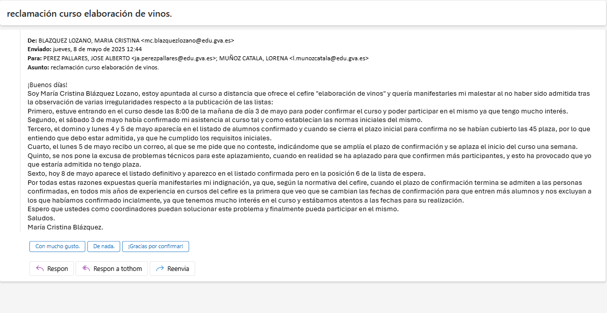
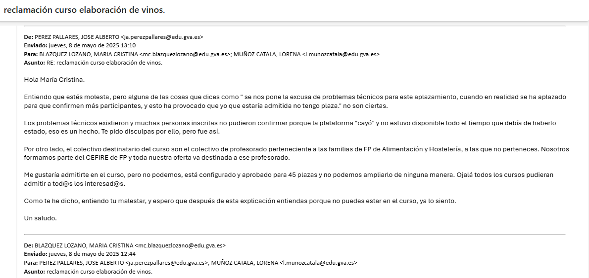
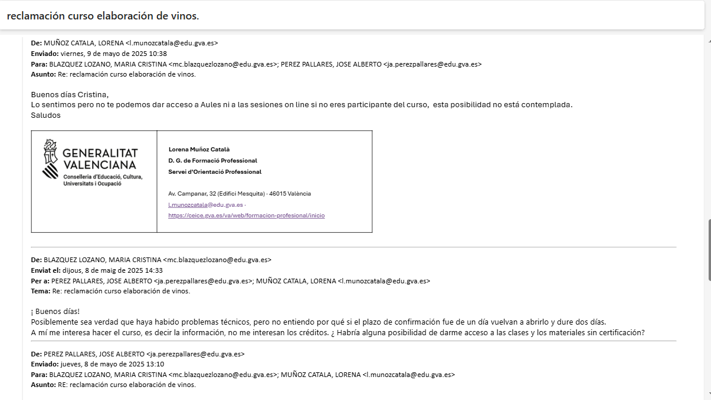

---
# Front matter
# Metainformació del document
title:  INFORME RECLAMACIÓN ADJUDICACIÓN PLAZAS
titlepage: true
author:  CURSO VINOS 25FP31CF002 - Elaboración de vinos
lang: es
page-background: bg.png
colorlinks: true

# portada
titlepage-rule-height: 2
titlepage-rule-color: "000000"
titlepage-text-color: "000000"
titlepage-background: portada.png

# configuració de l'índex
toc-own-page: true
toc-title: Contenidos
toc-depth: 2

# capçalera i peu
header-left:  INFORME RECLAMACIÓN
header-right: 
footer-left: CEFIRE FP
footer-right: \thepage/\pageref{LastPage}

# Les figures que apareguen on les definim i centrades
float-placement-figure: H
caption-justification: centering 

# No volem numerar les linies de codi
listings-disable-line-numbers: true

table-use-row-colors: true

# Configuracions dels paquets de latex
header-includes:

  #  imatges i subfigures
  - \usepackage{graphicx}
  - \usepackage{subfigure}
  - \usepackage{lastpage}
  - \usepackage{booktabs}
  # Per a fer tables en LATEX
  - \usepackage[table]{xcolor}
  - \setlength{\arrayrulewidth}{0.1mm}
  - \setlength{\tabcolsep}{12pt}
  - \renewcommand{\arraystretch}{2}
  - \newcolumntype{s}{>{\columncolor[HTML]{AAACED}} p{3cm}} # Definim tipus de columna
  - \arrayrulecolor[HTML]{d4d5c3} # Color de les línies

  #  - \usepackage{adjustbox}
  # marca d'aigua
  #- \usepackage{draftwatermark}
 # - \SetWatermarkText{\includegraphics{./img/Markdown.png}}
  #- \SetWatermarkText{Per revisar}
  #- \SetWatermarkScale{.5}
  #- \SetWatermarkAngle{20}
   
  # caixes d'avisos 
  - \usepackage{awesomebox}

  # text en columnes
  - \usepackage{multicol}
  - \setlength{\columnseprule}{1pt}
  - \setlength{\columnsep}{1em}

  # pàgines apaïsades
  - \usepackage{pdflscape}
  
  # per a permetre pandoc dins de blocs Latex
  - \newcommand{\hideFromPandoc}[1]{#1}
  - \hideFromPandoc {
      \let\Begin\begin
      \let\End\end
    }
 
# definició de les caixes d'avis
pandoc-latex-environment:
  noteblock: [note]
  tipblock: [tip]
  warningblock: [warning]
  cautionblock: [caution]
  importantblock: [important]
...

# Antecedentes de hecho:

## Primero

El curso 25FP31CF002 - Elaboración de vinos  según publicación con enlace [https://cefire.edu.gva.es/sfp/index.php?seccion=edicion&id=12688927](https://cefire.edu.gva.es/sfp/index.php?seccion=edicion&id=12688927) está organizado por el CEFIRE Especifico de FP dirigido a las Familias de Industrias Alimentaris y Hoteleria y Turismo según consta en las información publicada. Este curso ha sido planificado desde la Asesoría Química-Alimentaria después de valorarlo en las reuniones de red realizadas trimestralmente con los y las jefes de departamento  y coordinadores de FP/coordinadores de excelencia de los centros educatives de la família Industrias Alimentarias. 

El curso está aprobado y planificado en la Asesoría de família Industrias Alimentarias, por tanto el presupuesto adjudicado es para la formación del profesorado de Formación Professional y más concretamente para las familias en concreto que se han nombrado con anterioridad. 

Pasado el plazo de inscripción y confirmación y aplicados los baremos incluidos en la plataforma de gestión el programa ordena la lista según la puntuación asignada a las Especialidades de formación profesional concretas de las familias a las que va dirigido, posteriormente el profesorado que se indica en la publicación:

*	Personal docente y personal técnico educativo con destino en centros educativos no universitarios de la Comunitat Valenciana en los que se impartan las enseñanzas reguladas por la Ley Orgánica de Educación
*	Personal docente y personal técnico educativo que preste servicios técnicos de apoyo educativo a los centros indicados en el apartado anterior
*	Personal que haya finalizado los grados y máster que conducen a la obtención de la titulación docente, siempre que se encuentren inscritos en alguna de las bolsas de personal docente de la Conselleria de Educación, Cultura, Universidades y Empleo y dicho personal no suponga más del 50% de participación en la actividad

**REQUISITOS ESPECIFICOS:**

*	Para la selección de participantes se priorizará al profesorado de las familias de:
*	Industrias Alimentarias y Hostelería y Turismo
*	Resto de profesorado con atribución docente en Formación Profesional

En último lugar, si existen plazas disponibles entre el personal interesado se adjudican las plazas al resto del personal interesado inscrito y confirmado en plazo.
Los coordinadores del curso que constan en la formación son: Lorena Muñoz Catalá responsable de la família Industrias alimentarias y Jose Alberto Pérez Pallarés responsable de la família Hoteleria y Turismo, a las que va dirigida la formación.

## Segundo

El curso estaba previsto  en confirmación el pasado sábado 3 de mayo. 

Durante el  mismo sábado 3 de mayo recibimos varios correos de docentes que nos comunicaron habían tenido problemas y incidencias para realizar la confirmación.
Hubo incidencias durante el proceso de confirmación. Las personas que pudieron acceder a confirmar visualizaron un número provisional de baremos de confirmación en el listado, sin haberse aplicado todavía el baremos aplicado según especialidades a las que estaba dirigido.

Dadas las incidencias, el lunes 5 de mayo los coordinadores del curso ampliaron el periodo de confirmación y se aplazó la fecha de inicio del curso al 12 de mayo, siguiendo criterios de objetividad y buen uso de los recursos públicos.

El lunes 5 de mayo se envió un correo a todos los inscritos (confirmados y no confirmados) informando de las incidencias ocurridas y la ampliación del plazo de confirmación hasta el 7 de mayo para poder solucionar las incidencias y poder así realizar el curso  en condiciones adecuadas. 

Asignando así todas las plazas ofertadas de acuerdo a criterios de efectividad presupuestaria, uso correcto de los recursos públicos y de acuerdo al objeto de la financiación de la formación planificada y aprobada.(Formación professional de las familias Industrias Alimentarias y Hoteleria y Turismo), siguiendo requisitos publicados en la descripción de la actividad.

## Tercero

Pasado el plazo de confirmación, y aplicando los baremos establecidos de puntuación a cada una las especialidades a las cuales iba dirigido el curso, el día 8 de mayo se publicaron las listas definitivas del curso **25FP31CF002 - Elaboración de vinos**  según publicación con enlace: [https://cefire.edu.gva.es/sfp/index.php?seccion=edicion&id=12688927](https://cefire.edu.gva.es/sfp/index.php?seccion=edicion&id=12688927)

En el momento de publicar las listas definitives, el 8 de mayo se envió un correo a las persones adjudicadas, dando la bienvenida al curso y con indicaciones de inicio de curso el dia 12 de mayo.

## Cuarto

El dia 8 de mayo recibimos un correo de la docente  Maria Cristina Blazquez Lozano professora de secundaria con atribución docente  especialidad FÍSICA I QUÍMICA inscrita a las listas  con apreciaciones y interpretaciones  erróneas de la adjudicación de la lista definitiva expresando el descontento con la publicación de las listas definitivas. Algunas afirmaciones expresadas en el correo no eran ciertas o se habían interpretado de manera incorrecta.

Los coordinadores del curso atendimos las queja explicando los motivos considerados para  la ampliación en el plazo de confirmación para todos los inscritos inicialmente, así como los requisitos y baremación seguida en la adjudicación definitiva, indicando a la docente el motivo por el cual había quedado excluida.

Después de las explicaciones dadas a la docente, continuo haciendo correos y expresó que no le interesaba la certificación solo la formación del curso. La docente nos pidió acceso a Aules y a enlaces de las sesiones on line para poder acceder. Los coordinadores del curso le informamos que esta posibilidad de acceso no estaba contemplada.

## Quinto

Dia 12 de mayo recibimos un correo  en que se nos sol·licita redacción de informe por parte  de la dirección del CEFIRE de FP para dar respuesta a la reclamación que a continuación se acompaña presentada por Dª María Cristina Blazquez Lozano respecto a la formación “Curso a distancia 25FP31CF002 - Elaboración de vinos”

Adjunto adjuntamos  evidencias de correos intercambiados con la docente a su reclamación como evidencia de la atención recibida de su queja por parte de los coordinadores del curso.

